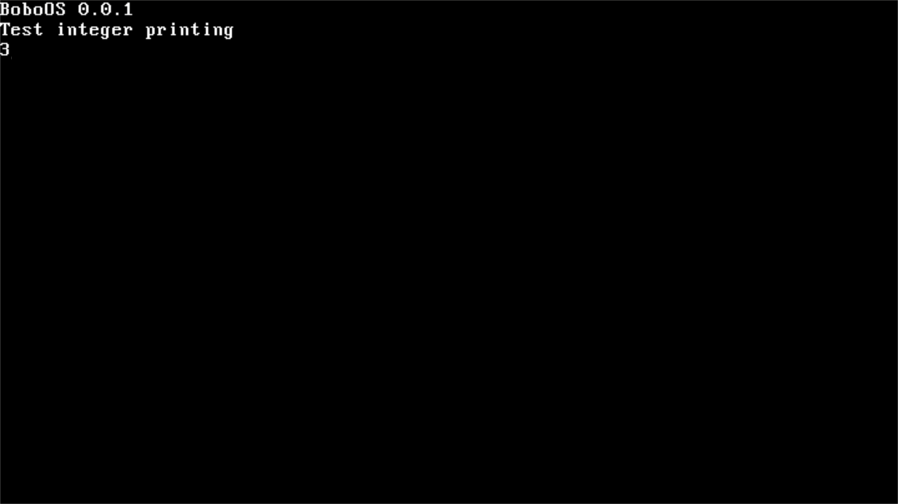

# BoboOS

## Overview

BoboOS is a simple 64-bit operating system that mostly does nothing.

**Open Source**: Fully open source under the [MIT License](LICENSE).

an image of the current state of the operating system




## Getting Started

### Prerequisites

To build and run BoboOS, you will need:

- A supported x86_64 architecture system.
- [GNU Make](https://www.gnu.org/software/make/) for building the project.
- [Docker](https://www.docker.com/) for creating our build-environment.
- [QEMU](https://www.qemu.org/) for testing the project.

### Building the OS

To build BoboOS, follow these steps:

1. Clone the repository:
   ```bash
   git clone https://github.com/asdasda3456/BoboOS.git
   cd asdasdaos
   ```
2. Build Docker image:
   ```bash
   docker build buildenv -t asdos-buildenv
   ```
3. Enter build environment:
    
    - For Windows (cmd): `docker run --rm -it -v "%cd%:/root/env" asdos-buildenv`
    - For Windows (PowerShell): `docker run --rm -it -v "${pwd}:/root/env" asdos-buildenv`
    - For Linux: `docker run --rm -it -v "$(pwd)":/root/env asdos-buildenv`

4. Build the project using the Makefile:
   ```bash
   make build build-x86_64
   ```
5. Exit the build environment:
    - Type `exit`
6. The output will be generated in the `dist/x86_64/` directory.

### Running the OS

Run the OS in QEMU:

```bash
qemu-system-x86_64 -kernel dist/x86_64/kernel.bin
```

## Contributing

Contributions are welcome! Please follow these steps:

1. Fork the repository.
2. Create a new branch for your feature or bug fix.
3. Commit your changes.
4. Push to the branch.
5. Create a pull request.

## License

This project is licensed under the MIT License - see the [LICENSE](LICENSE) file for details.

## Acknowledgments

- Thanks to [OSDEV.wiki](https://osdev.wiki/wiki/Expanded_Main_Page), and all the tutorials out there.
- Special thanks to the open-source projects that inspired BoboOS.
